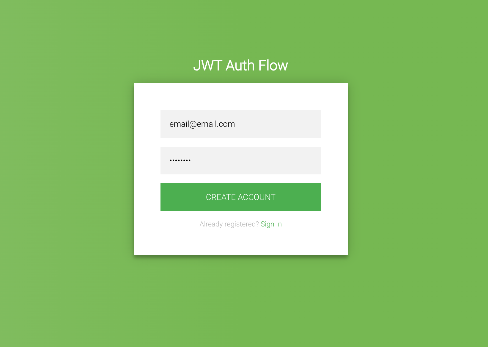

# jwt-auth-flow

**The web app is in the /src directory while the api is in the /server directory.**

---

### Steps to get started:

1. Run `yarn` to install the required dependencies
2. Make sure your local mongod instance is running
3. Run `yarn dev:server` to start the api server
4. Open a new terminal window & run `yarn dev:app` to start the web server
5. Go to `http://localhost:3000` in your browser to verify everything is running
6. Create a new account either with the provide values or custom values
7. Click the Sign In link at the bottom to go to the login form
8. Upon successful login you should be redirected to the secure profile screen

You should see the following:

---

Links used as a reference in creating this authentication flow:

- https://www.digitalocean.com/community/tutorials/api-authentication-with-json-web-tokensjwt-and-passport
  
- https://github.com/auth0/node-jsonwebtoken

- https://jakeowen-ex.medium.com/secure-api-authentication-with-nextjs-http-only-cookie-b4ea0569bbfc

- https://medium.com/@ryanchenkie_40935/react-authentication-how-to-store-jwt-in-a-cookie-346519310e81

- https://hasura.io/blog/best-practices-of-using-jwt-with-graphql/#basics-login
